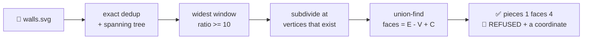

<h1 align="center">planimeter</h1>

<p align="center"><b>Three integers for any geometry file an agent writes. Never look at the picture again.</b></p>

<p align="center">
  <b>pieces</b>, <b>enclosed faces</b>, <b>Euler characteristic</b> — read from the arrangement,
  not from a render. Every count ships with the <b>snap radius that decided it</b>. When no
  defensible radius exists, <code>planimeter</code> doesn't pick one and hope. It
  <b>refuses</b>, and names the coordinate to go and look at.<br>
  A <code>PostToolUse</code> hook stamps one twelve-token line on every geometric write, so
  the agent knows what is in the file it just wrote without opening it.
</p>

<p align="center">
  
</p>

<p align="center">
  Invented by <b>Teerth Sharma</b> · <a href="mailto:teerths57@gmail.com">teerths57@gmail.com</a> · <a href="https://github.com/teerthsharma/planimeter">github.com/teerthsharma/planimeter</a>
</p>

<p align="center">
  <a href="https://github.com/teerthsharma/planimeter/blob/main/RESULTS.md"></a>
  <a href="https://github.com/teerthsharma/planimeter/blob/main/RESULTS.md#1-g2--wrong-integers-on-the-jitter-stratum"></a>
  <a href="https://github.com/teerthsharma/planimeter/blob/main/pyproject.toml"></a>
  
  
  <a href="https://github.com/teerthsharma/planimeter/blob/main/RESULTS.md#5-g3--cost-and-it-loses"></a>
</p>

```bash
pip install planimeter      # or:  uv tool install planimeter
planimeter --demo           # a built-in 2x2 grid, certified, in one command
planimeter init             # install the hook — prints the diff, writes nothing unconfirmed
```

> ### 📈 `0` wrong integers in **528** draws, where `shapely.polygonize_full` returns **336**
>
> On the stratum where near-coincident vertices decide the answer: **495 exact, 33 refused,
> 0 silently wrong.** And the sharpest control in the file — `polygonize` handed
> **planimeter's own certified radius** — still returns **22 wrong**. That control was built
> to make this tool pointless and it did not.
> → [RESULTS.md §1](https://github.com/teerthsharma/planimeter/blob/main/RESULTS.md#1-g2--wrong-integers-on-the-jitter-stratum)

<!-- generated: plan -->
```
==============================================================================
  planimeter  plan.svg
==============================================================================
  pieces               1
  faces                4
  chi                 -3      chi = pieces - faces = V - E
------------------------------------------------------------------------------
  vertices             9      edges           12
  subdivided           0      dup edges        0
  merged               0      max cluster diam 0
  snap window   [1.819e-12, 1)   ratio 5.498e+11   radius 1.349e-06   derived
  rho 10   flatten 16/32   candidates tried 1
  digest  c6fc6d6fbc54eb3c
==============================================================================
```

**`snap window [1.819e-12, 1)` is the line no other tool prints.** The vertex partition is
identical at *every* radius in that window; the window is `5.5e11` times wider than it is
tall; `derived` says planimeter chose it, not you. **Zero-shot. No training. No neural
network. No render. No resolution. No GPU.** `numpy`, `svgelements`, and a formula from 1758.

---

## ⚙️ How it works



1. 📏 **Collapse what is bitwise identical.** An identification, not a tolerance. Nothing invented yet.
2. 🌲 **Get the whole spectrum of interesting radii.** Single-linkage merge heights *are* the sorted edge weights of the Euclidean minimum spanning tree — so `n-1` numbers, once, and no clustering loop.
3. 🎯 **Take the widest gap in that spectrum.** A window `[t_below, t_above)` at least `10x` wide, or **REFUSE**. This is the transplant from cleave and [sigmoid](https://github.com/teerthsharma/sigmoid): the threshold comes from the widest representable gap, or there is no answer.
4. ✂️ **Split edges only at vertices the file already contains.** No intersection is ever computed, no vertex is ever moved. A vertex in the ambiguous band `(0, t_above)` from a wall it does not touch is a **refusal with that coordinate**, not a coin flip.
5. 🔢 **Count.** One union-find pass. `faces = E - V + C`. Exact integers, no float.

---

## 🪝 The hook slot

`planimeter init` writes one `PostToolUse` entry. After that the agent gets an integer on
every geometric write and never has to look at the picture:

```
planimeter walls.svg  pieces 1  faces 4
planimeter walls.svg  pieces 1  faces 4 -> 5
planimeter walls.svg  vertex near edge
```

**7 `cl100k_base` tokens of body**, 5 more for the path. A write to `notes.py` produces
**zero bytes** — the suffix check runs before any import, costing **under 15 ms over an
interpreter that does nothing** across seven runs, and saving **84 to 105 ms** on every
non-geometry write
([RESULTS.md §6](https://github.com/teerthsharma/planimeter/blob/main/RESULTS.md#6-g7--hook-wall-clock-with-a-floor-control)).

Four contract clauses, each with a test: **silence is the default** · **bounded work or a
budget refusal, never a stalled turn** · **it never raises** (any exception → exit 0, empty
stdout; a hook that can break a session gets uninstalled on day two) · **it never writes to
a geometry file, on any path** — which is the whole reason a write-triggered hook is
installable, and why *"heal the geometry"* will never be a feature here.

A refusal stamps its one non-imperative token **only when the reason changed**. Thirty
identical refusal lines in a session train an agent to ignore the tool.

---

## 🔮 Predict, then verify

State the number **before** the edit; an integer checks the claim after it. No vision check
and no area check can even express a claim of this shape.

```bash
planimeter check plan_loop.svg --faces 5      # after the edit landed
```

<!-- generated: check-held -->
```
  CLAIM   faces    stated 5       measured 5       HELD
```

and the same claim against the file before it, which is the four-face `plan.svg` above:

```bash
planimeter check plan.svg --faces 5
```

<!-- generated: check-broken -->
```
  CLAIM   faces    stated 5       measured 4       BROKEN
```

`0` HELD · `1` BROKEN · `2` REFUSED. **Three states, not two** — *"the tool could not
answer"* must never be readable as *"your prediction was wrong"*. Whether agents state the
number unprompted is **unmeasured and [NOT EARNED](#-what-we-got-wrong)**; `init` appends
two lines to `CLAUDE.md` asking for it, which is a nudge, not a result.

---

## 🧮 The math, in sixty seconds

For any graph embedded in the plane with `V` vertices, `E` edges and `C` components, where
`F` counts **all** faces including the single unbounded one:

$$
V - E + F = 1 + C \quad\Longrightarrow\quad \mathrm{faces} = F - 1 = E - V + C = b_1
$$

That last term is the **first Betti number** of the 1-complex — the number of independent
cycles. A triangle: `V=3, E=3, F=2`, so `faces = 3 - 3 + 1 = 1`. And `chi = V - E = pieces - faces`.

**This is 18th-century arithmetic and it is not where the risk is.** It is one union-find
pass. *The entire engineering problem is deciding which vertices are the same vertex.*

That is what the window certifies. By **Gower & Ross (1969)** the single-linkage merge
heights of a point set are exactly the sorted EMST edge weights, so the candidate radii are
`n-1` numbers. The certificate is:

$$
\pi(r) \text{ is constant for every } r \in [t_{\mathrm{below}}, t_{\mathrm{above}}) \quad\text{with}\quad \frac{t_{\mathrm{above}}}{t_{\mathrm{below}}} \geq \rho
$$

and for that partition the minimum distance between two clusters is **exactly** `t_above`,
by Kruskal's cut property. **The identification does not move anywhere in a window ten times
wide.** That is strictly weaker than *"the identification is right"* — and saying which one
is claimed is the entire point.

---

## ✅🛑 What it certifies, and what it refuses

**CERTIFIED means six things were checked, not assumed:** a window at least `rho` wide
exists; every input segment survived the merge; every (vertex, non-incident edge) pair sits
at distance exactly `0` or at least `t_above`, nothing in between; no two segments still
cross after subdivision; the float64 margin condition holds, so every sign is provably
correct with no rational arithmetic; and curves flattened at `N` and `2N` gave identical
integers.

| verdict | when | what you get | exit |
|---|---|---|---|
| ✅ **CERTIFIED** | all six hold | `pieces`, `faces`, `chi`, and the window that decided them | `0` |
| 🛑 **REFUSED** | one named condition could not be established | the reason, the coordinate, the element id, one imperative action | `2` |
| ⚫ **BAD INPUT** | the file cannot be read, or the flags do not parse | **not a verdict** — the tool never ran | `3` |

<!-- generated: wall -->
```
==============================================================================
  planimeter  wall_missing_the_floor.svg                           REFUSED
==============================================================================
  reason   VERTEX_NEAR_EDGE   (geometry)
  detail   1 vertex sits inside the ambiguous band (0, 5)
  look at  (5, 2.2e-06)  element=line#s4  edge=line#s0  d=2.2e-06
  action   move this end onto the wall, or away from it by more than 5
==============================================================================
```

That is a crosswall missing its floor by `2.2e-6`. Close the gap and the wall divides the
room, `faces 2`; leave it and the wall is a dangle, `faces 1`. **Nothing in the file says
which.** Every competitor returns one of the two integers. planimeter returns the
coordinate.

Ten refusal codes, each actionable by a stranger, each in the file's own coordinates with
the owning element id: `NO_STABLE_SCALE` · `VERTEX_NEAR_EDGE` · `EDGES_CROSS` ·
`EDGE_COLLAPSED` · `CURVE_UNSTABLE` · `MARGIN_TOO_SMALL` · `NO_GEOMETRY` ·
`TOO_MANY_PAIRS` · `TOO_MANY_VERTICES` · `BAD_INPUT`. Every refusal carries `kind`:
`geometry` means *go re-observe the drawing*, `budget` means *this machine ran out of room*.

🔴 **Never claimed, in any code path or output string:** `watertight`, `manifold`, `valid`,
`healed`, `repaired` — `faces >= 1` is not closure and never becomes it. No area, length or
perimeter *of the drawing*: the instrument this is named for measures area by tracing a
boundary; this one only counts boundaries. No confidence, probability or score. Not what a
renderer will draw — **two overlapping filled rectangles are 3 arrangement faces and 2
visible regions**, and that is the most likely *"your number is wrong"* moment, so it goes
here and not in a footnote. Not that the radius is *correct* — only that it is *certified*.

---

## 📊 Benchmarks

Pasted from `bench.py`'s own stdout at commit `5713012` — the last commit that changed
code — on one machine. No number in this repository is hand-typed. **[Every table, every
control, and every arm that lost →
RESULTS.md](https://github.com/teerthsharma/planimeter/blob/main/RESULTS.md)**

<p align="center">
  
</p>

44 figure families × 6 levels of `sigma/g` in `1e-7..1e-2` × 2 seeds = **528 draws**. Truth
comes from each family's construction recipe, and a test parses `corpus.py`'s AST to prove
the corpus imports nothing from the package's counting, snapping or arrangement layers — so
it cannot borrow the arithmetic it is grading.

```
    planimeter                                    0 wrong   495 exact    33 refused  / 528
    round-to-6-decimals dict snap  STRAWMAN     350 wrong   178 exact     0 refused  / 528
    networkx b1 after a round-6 snap            350 wrong   178 exact     0 refused  / 528
    shapely polygonize_full(unary_union)        336 wrong   192 exact     0 refused  / 528
    shapely set_precision(1e-6) + the above     299 wrong   229 exact     0 refused  / 528
    skimage.euler_number @  512 px                2 wrong    64 exact     0 refused  / 66  (stride 8)
    skimage.euler_number @ 4096 px                7 wrong    59 exact     0 refused  / 66  (stride 8)
    CONTROL refuse-on-anything                    0 wrong     0 exact   528 refused  / 528
    CONTROL polygonize @ planimeter's radius     22 wrong   473 exact    33 refused  / 528
```

What that table is actually saying:

- 🥇 **The oracle control, `22 wrong`.** `set_precision` handed planimeter's own certified
  radius, then `unary_union`, then `polygonize_full`. **If this had scored zero the counting
  layer would contribute nothing** and the entire product would be the printed scale. It was
  the sharpest control in the design and it came back in the tool's favour.
- 🧯 **`refuse-on-anything`, `0 wrong`.** A tool that refuses everything also scores zero.
  planimeter's zero is only worth reading beside its **495 exact**.
- 🖼️ **The two raster rows are a pair, and the pair is the point.** `euler_number` is exact
  and linear — there is no speed story here and none is told. What it needs is a
  *resolution*, and the answer **moves with it**: at 4096 px it is **worse**, 7 wrong
  against 2. The invented number reappears one layer down.
- ⚠️ **`STRAWMAN` is the benchmark's own word for that row**, printed by `bench.py`, not a
  hedge added later. A hand-rolled round-6 snap is not the baseline this headline may be
  quoted against — see [NOT EARNED](#-what-we-got-wrong).

**Hook wall clock**, 20 cold subprocesses per row on Windows, with a floor control that was
added *after* the threshold was committed:

```
    FLOOR bare interpreter, no hook at all        52.4 ms median  [48.0, 70.8]
    silent path (.py write)                       56.4 ms median  [46.7, 62.9]  holds
    CONTROL same hook, suffix check removed      154.0 ms median  [138.9, 163.4]
    geometry path (.svg write)                   158.6 ms median  [145.0, 168.7]  holds
```

`python -c pass` costs 52.4 ms on this machine, so the silent path is **4.0 ms of
planimeter** and 52.4 ms of Windows — and that 4.0 ms is two noisy medians subtracted,
which across seven runs came out 9.0, 2.0, 2.4, 4.7, 14.6, 4.0 and 4.0, so the honest form
of the claim is **under about 15 ms**, not a number. **The 60 ms gate sits 8 ms above the
floor, inside the machine's own spread**: across eleven runs the silent path measured 52.5,
63.3, 54.8, 60.5, 55.7, 53.4, 56.9, 59.0, 70.3, 57.7 and 56.4 ms, and three of the eleven
blew the gate and were printed as `KILLS`. The threshold has not been moved and every run
is reported, because a gate that is re-rolled until it passes is not a gate.

**Real input**, files this repository did not write, fetched by a pinned recipe rather than
picked one at a time. **No file in either set has a ground truth**, so these are refusal
rates and method-agreement rates, never accuracy
([RESULTS.md §11](https://github.com/teerthsharma/planimeter/blob/main/RESULTS.md#11-real-input--files-this-repository-did-not-write)):

```
    13,681 npm icon files (tabler, feather, bootstrap, MIT, pinned versions)
        answered   10,862   79.4%       median 37 ms
        refused     2,819   20.6%       EDGES_CROSS 12.5%  VERTEX_NEAR_EDGE 5.5%
                                        CURVE_UNSTABLE 2.3%  budget 0.2%

    96 Wikimedia Commons floor plans — the advertised use case
        answered        0    0.0%       at the default vertex ceiling
        answered        1    1.0%       at --max-vertices 6000
        refused        95   99.0%       budget 59.4%  VERTEX_NEAR_EDGE 22.9%
                                        EDGES_CROSS 12.5%
```

🧾 **Four icon files in five get an integer; one floor plan in ninety-six does.** A published
floor plan is drawn, not built — a wall ends *near* a wall instead of on it, two walls cross
where the file records no vertex — and those are precisely the two conditions this tool
refuses. **Raising the ceiling does not buy answers on that set, it buys coordinates**: of the 31
files the higher ceiling admits, 30 turn into a named geometry refusal and 1 into an answer. On a
subsample where the budget cannot bind at all, `--max-vertices 25000`, it is 0 of 4.

🔬 **The one control on real input that can be adjudicated.** On the 30 committed sample
files the round-6 strawman returns a different integer on **7 of 30**, and on all seven
`skimage.euler_number` at 4096 px sides with the certified radius. The raster disagrees with
the arrangement on 1 of 30, and that one is the rendered-regions seam, not a count.

### Reproduce all of it

```bash
python -m venv .venv && . .venv/*/activate    # .venv\Scripts\activate on Windows
pip install -e ".[test]"
pytest -q                                     # 479 passed
python bench.py                               # sections 1-10, ~60 s
python realdata.py run --set sample           # section 11, on the 30 committed files
python realdata.py fetch && python realdata.py run   # 61 MB, not committed
python -m planimeter --demo
```

---

## 🩹 The honest seam, stated rather than hidden

The window rule is single-linkage clustering cut at the largest dendrogram gap over an MST —
**about ten lines of numpy** — and nothing mathematical stops a sandbox agent from writing
it. **The guarantee is a policy, `refuse rather than guess`, not a barrier.** What an agent
does not write unprompted is the vertex-to-edge quantifier and the exactly-incident
subdivision, not the ten lines of clustering. Whether that holds in practice is an empirical
question, and it **has not been measured**.

---

## 📚 Prior art

Naming who did it first, and where they are better, is what makes the rest believable.

| work | what they have that this does not | what `planimeter` adds |
|---|---|---|
| **[gis-mcp](https://github.com/mahdin75/gis-mcp)** (189★) | 92+ shapely / pyproj / geopandas tools placed directly in front of an agent over MCP — **the strongest form of the objection**, because no code interpreter is needed | its README has zero occurrences of `polygonize`, `set_precision` or `euler`: the tools are there, the certified-scale question is never asked |
| **shapely / GEOS `ops.polygonize_full`** | the face count, faster and more general, **with a real diagnostic** — polygons, cuts, dangles, and the unclosed edges by name | a return value that says *which identification decided the count* |
| **`shapely.set_precision`** | GEOS's own snap, and it will accept any grid size you hand it | the grid size, derived from the drawing and certified — or a refusal |
| **`skimage.measure.euler_number`** | exact, linear, a different library and a different algorithm — the third-party control this repo owes it | no raster, so no invented resolution; the raster answer moves between 512 px and 4096 px |
| **`networkx`** | `E - V + C` in one line, pure Python, already installed in most sandboxes — it reimplements the counting layer exactly | the graph, which is the entire problem |
| **CGAL / scikit-geometry** | exact predicates, done properly, for decades | pip-installability (neither is on PyPI), and the *intended* question rather than the exact one — exact predicates make two nearly-coincident vertices genuinely distinct and return the exact face count of a graph nobody drew |
| **Wolfram Local MCP** | genuinely has the mathematics **and** local file access — the one real near-miss | free, and a hook slot; it returns an answer rather than a certificate |
| **`pre-commit`, `lint-staged`** | the whole "run a thing on every write" idea, for humans, years ago | the same slot for the **agent**, where every documented occupant today is a formatter or a linter |
| **Gower & Ross (1969)** | the theorem the window rests on: merge heights are the sorted MST weights | nothing — it is cited because §4.3 is a theorem and not an empirical hope |
| **Euler (1758)** | the arithmetic | nothing |

Also standing on **cleave** and **sigmoid** — the same author's repositories the
widest-representable-gap rule transplants from — and on **[tangle](https://github.com/teerthsharma/tangle)**,
whose shape this is: an exact integer, a one-directional certificate, a typed refusal naming
what to re-observe, and a bench with controls.

---

## 💥 What we got wrong

<p align="center">
  
</p>

- 🪦 **"Usable as a hook on a real floor plan" is withdrawn, not softened.** The gate was
  committed before any number existed: exponent above `1.3`, or above `50 ms` at 100,000
  vertices, and the sentence dies. Measured exponent **`1.825`**, extrapolating to
  **`740,531 ms`**. Both blown by orders of magnitude. The comfortable range is under roughly
  **600 segments** — 43 ms at 544, 1.9 s at 3,784 — and above the vertex ceiling it refuses
  `TOO_MANY_VERTICES` rather than stalling a turn. That ceiling is a **default, not a limit
  of the method**: `--max-vertices` spends past it and the pair budget follows it, measured
  on real plans at 0.26 s for the incidence pass at 2,273 vertices and 40.0 s at 22,261. A
  k-d tree does not fix this: the certificate's precondition quantifies over *every*
  (vertex, edge) pair, and a nearest-neighbour structure answers a different question.
- 🪦 **There is no refusal cliff.** The design predicted a level where everything certifies
  and a level two steps later where everything refuses. Refusals sit between **3 and 10 of
  88 at every level**, including the smallest, and do not order monotonically with the
  jitter. **NOT EARNED.** What *is* flat at zero across all six levels is the wrong count.
- 🪦 **Raising `rho` does not make it stricter.** At `rho = 100` it gets **3 wrong**:
  removing the genuine merge window leaves the merge-nothing window, whose ratio is
  drawing-scale over machine epsilon for arithmetic reasons alone. **Zero-wrong is a claim
  about `rho <= 10`**, and `bench.py` prints that paragraph under its own table so the caveat
  cannot be separated from the number.
- 🪦 **Two clean squares a tenth of their own size apart read as one piece.** No jitter at
  all. 1.00 apart → one piece; 1.01 apart → two. Inside the stated convention, outside what
  a reader looking at the picture would say. It has a name in the corpus and a test.
- 🪦 **The design specified GEOS's Delaunay triangulation for the spanning tree.** Measured,
  it omits a true MST edge on **1 of 793** point sets — all of them in the *clustered*
  stratum, which is exactly the stratum this tool exists for. Replaced with an exact
  vectorised Prim; **shapely and GEOS left the dependency list with it**, and "no
  GEOS-invented tolerance" became literally true rather than rhetorically true.
- 🪦 **Five claims were cut before the first line of code**, three because a reviewer would
  have checked them: that `polygonize` offers no diagnostic (**false** — it returns dangles
  and names the unclosed edges); that determinism and latency are differentiators (GEOS is
  deterministic, and shapely on a small file is already sub-millisecond); and a speed
  figure that was a persistent-homology number selling an Euler-characteristic tool.
- 📉 **NOT EARNED — and this is the load-bearing one.** The accuracy headline's strongest
  comparison arm is a hand-written round-6 script, labelled `STRAWMAN` by the benchmark
  itself. **The baseline that decides whether there is a product is the code an agent writes
  unprompted on a first attempt, sampled twenty times with the whole distribution
  published.** That has not been collected. If its median clears the stratum, the accuracy
  headline dies and what remains is the printed scale and the hook slot — and that outcome
  gets published here, not hidden.
- 🪦 **It is a linter for unnoded geometry, and that is now measured rather than feared.**
  The question this section used to leave open — are real files jittery enough for vertex
  identity to be contested — has an answer on 13,777 real files: **20.6% of icon files and
  99.0% of Commons floor plans refuse**, and once the vertex ceiling stops binding the
  refusals are almost entirely `EDGES_CROSS` and `VERTEX_NEAR_EDGE`. On the advertised use
  case, floor plans, the answer rate is **1 of 96**. That is the design's price and it is
  printed at the top of the benchmark section, not in a footnote.
- 📉 **No agent-written file has been measured.** `corpus/found/` is still empty. The real
  corpus above was drawn by people in Inkscape and emitted by icon build tools, and **none
  of it carries a ground truth**, so it produces refusal histograms and method agreement,
  never an accuracy number.
- 🪦 **A refusal the tool could not have made was being made.** A budget refusal on the `2N`
  curve-stability pass was reported as `CURVE_UNSTABLE` — *go re-observe the drawing* — when
  what happened is that the machine ran out of room on a pass carrying twice the vertices.
  It hit 11 of 96 real plans, and one of them, at 1,295 vertices, was under the ceiling all
  along and certifies.
- 📉 **The vision comparison was cut, not repaired.** It scored perfectly only because it
  read exact coordinate text rather than a render. Re-running it against a raster is a
  different experiment than the one that was reported.

---

## ⚠️ Limits

Collected once, here.

- **One machine, one OS, one Python.** Windows 11, 3.11.9, numpy 2.4.6.
- **The jitter stratum is synthetic.** Its truth comes from construction recipes, so it
  measures the arrangement layer and says nothing about real files.
- **The real corpus has no ground truth and no agent-written file in it.** 13,681 npm icons
  and 96 Commons plans, drawn by people and by build tools. Every number from it is a
  refusal rate or an agreement rate between two methods. **Refusal rates do not compose**:
  20.6% on icons, 99.0% on plans at one ceiling, and 5–10 of 88 per synthetic jitter level
  are three different questions.
- **`corpus/real/sample/` is 30 files, committed so the numbers can be re-run without a
  download.** Its 100% answer rate is the icon set restricted to small files, not a headline.
- **`rho`, `CAND_MAX` and `FLOOR_ULPS` are three constants this package chose**, in a tool
  whose pitch is that it refuses to invent numbers. They are scale-free, printed on every
  answer, movable by flag, and `rho` gets a published sensitivity table. That is strictly
  more than shapely, GEOS or scikit-image offer, and it is still three chosen numbers.
- **Uniqueness of the certified scale is not established.** At most 4 windows are tried,
  widest ratio first, first pass wins. A second window might also have passed.
- **`faces` is arrangement-theoretic and does not match what a renderer fills.** There is no
  fix; there is the sentence and the refusal to claim otherwise.
- **Refinement stability across `N` and `2N` is evidence, not a theorem.** Two nearly tangent
  curves can gain or lose an intersection at any positive flattening tolerance.
- **SVG line work only, today.** `planimeter.segments()` is public, so feeding it geometry it
  cannot parse costs three lines. **A JS/TS repo with no Python at all** is a stated scope
  limit, not a gap to discover later.
- **Install the hook with `uv tool install planimeter` or pipx**, never a bare `pip` into a
  project venv — a venv-relative hook silently never fires the moment the venv is not active.
- **The hook slot is someone else's schema.** If the `PostToolUse` payload shape changes the
  stamp silently stops, and every hook error is deliberately silent. A recorded-payload
  fixture test and `planimeter init --check` are the mitigation.

---

## 🗺️ Roadmap

- 🎯 **Sample the real baseline (G1).** Twenty unprompted first-attempt agent scripts against the closed-form corpus, whole distribution published, classified by which library each reached for. This is the gate that decides whether the accuracy headline lives.
- 📂 **The found corpus (G5, G6).** The refusal histogram now exists for 13,777 real files with no truth ([§11](https://github.com/teerthsharma/planimeter/blob/main/RESULTS.md#11-real-input--files-this-repository-did-not-write)). What is still missing is the specified corpus: ~30 real **agent-written** SVGs with truth established by a second method *before* planimeter runs on them.
- ⚡ **The incidence pass is what puts floor plans in scope, and §11 says by how much.** The median Commons plan carries 6,398 endpoints against a 2,000 default; `--max-vertices` reaches them at 40 s a file. A sweep line is the fix, and the all-pairs pass stays as its test control.
- ⚡ **A sweep line for the incidence pass.** The `1.825` exponent is the all-pairs (vertex, edge) quantifier. Fixing it is what puts real floor plans back in scope.
- 🗺️ **More readers** — GeoJSON, WKT, DXF — shipped when the found corpus contains that format, and not before.
- 🔌 **MCP.** `gis-mcp` owns that surface with 92+ tools; the hook is the difference. Ask if you want one.

---

## 🧰 API

```python
import planimeter

c = planimeter.chi("walls.svg")             # Chi, or Refused. Never raises for geometry.
c.pieces, c.faces, c.chi                    # 1, 5, -4
c.t_below, c.t_above, c.ratio, c.radius     # the certificate
c.grid_source                               # "derived" | "user"
c.json()                                    # the machine shape

planimeter.chi("plan.svg", max_vertices=6000)   # spend past the default vertex ceiling
planimeter.chi_segments(seg)                # from an (m, 2, 2) float64 array — no parser
planimeter.segments("walls.svg")            # the escape hatch: array + ids + skipped
planimeter.check("walls.svg", faces=5)      # HELD | BROKEN | REFUSED
planimeter.snap.window(points)              # the honest seam, exposed on its own
```

`bool(Refused(...))` is `False` and `int(Refused(...))` raises `TypeError` naming the reason,
so `if faces(f):` cannot silently read a refusal as truthy. Every module carries a runnable
self-check: `python -m planimeter.snap`, `python -m planimeter.arrange`, and so on.

---

<p align="center"><sub>
<a href="https://github.com/teerthsharma/planimeter/blob/main/LICENSE">MIT</a> · python ≥ 3.9 · <a href="https://github.com/teerthsharma/planimeter/blob/main/RESULTS.md">RESULTS.md</a> ·
Invented by <b>Teerth Sharma</b> · teerths57@gmail.com ·
<a href="https://github.com/teerthsharma/planimeter">github.com/teerthsharma/planimeter</a><br>
<code>euler-characteristic · planar-arrangement · betti-number · union-find · certified-snap ·
typed-refusal · agent-tooling · posttooluse-hook</code>
</sub></p>
