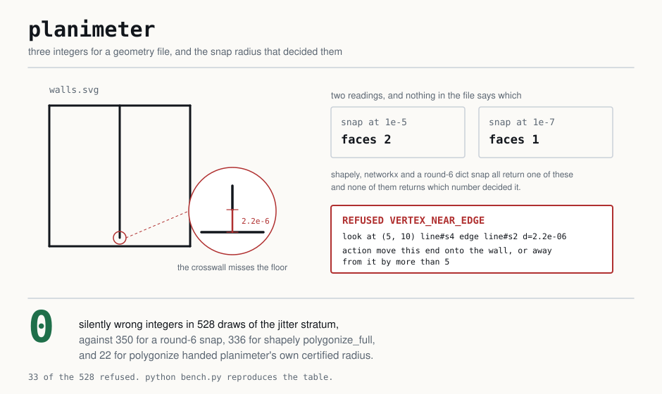
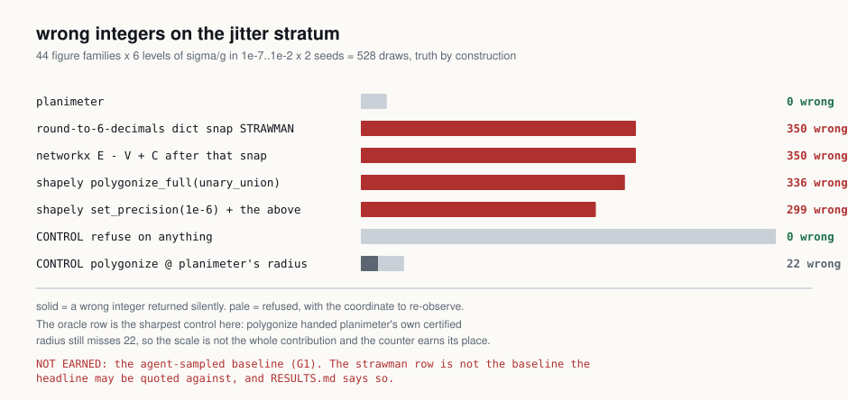
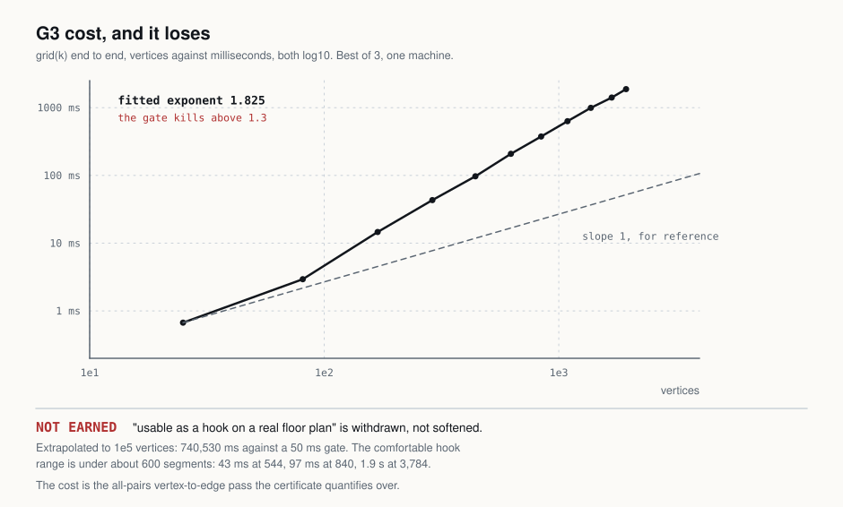

# planimeter

Three integers for a geometry file an agent just wrote — **pieces**, **enclosed faces**,
**Euler characteristic** — computed from the arrangement rather than from a render, or a
typed refusal naming the coordinate to go and look at. A `PostToolUse` hook stamps one
short line on every geometric write, so the agent never has to look at the picture to know
what is in it.

**0 silently wrong integers in 528 draws** of the stratum where near-coincident vertices
decide the answer, against 350 for a round-to-six-decimals snap and 336 for
`shapely.polygonize_full`. Every number in that sentence, its control, and the three gates
that did not clear are in [RESULTS.md](RESULTS.md).

```
pip install planimeter          # or: uv tool install planimeter
planimeter --demo
```

---

## The thing nothing else prints

Every tool that turns line work into a face count has to decide **which vertices are the
same vertex**, and every one of them makes you invent the number that decides it.

`polygonize` consumes noded input and invents nothing, so closing a dangle requires a grid
size or a snapping tolerance pulled from nowhere. `set_precision` takes that grid size as
an argument. `skimage.measure.euler_number` is exact and linear, but it takes a raster, so
the invented number reappears one layer down as a rasterisation resolution. **No return
value in GEOS, shapely or scikit-image ever says that the number you invented is what
decided this count.**

planimeter prints it, and refuses when no defensible one exists:

<!-- generated: plan -->
```
==============================================================================
  planimeter  plan.svg
==============================================================================
  pieces               1
  faces                4
  chi                 -3      chi = pieces - faces = V - E
------------------------------------------------------------------------------
  vertices             9      edges           12
  subdivided           0      dup edges        0
  merged               0      max cluster diam 0
  snap window   [1.819e-12, 1)   ratio 5.498e+11   radius 1.349e-06   derived
  rho 10   flatten 16/32   candidates tried 1
  digest  c6fc6d6fbc54eb3c
==============================================================================
```

`snap window [1.819e-12, 1)` is the certificate. The vertex partition is the same at
*every* radius in that window, the window is `5.5e11` times wider than it is tall, and
`derived` says planimeter chose it rather than the user. When no window survives, there is
no integer:

<!-- generated: wall -->
```
==============================================================================
  planimeter  wall_missing_the_floor.svg                           REFUSED
==============================================================================
  reason   VERTEX_NEAR_EDGE   (geometry)
  detail   1 vertex sits inside the ambiguous band (0, 5)
  look at  (5, 10)  element=line#s4  edge=line#s2  d=2.2e-06
  action   move this end onto the wall, or away from it by more than 5
==============================================================================
```

That is a wall whose end misses its floor by `2.2e-6`. Snap at `1e-5` and it is one room;
snap at `1e-7` and it is a dangling wall. Nothing in the file says which. Every competitor
returns one of the two integers; planimeter returns the coordinate.

---

## Predict, then verify

State the number **before** the edit, and an integer checks the claim after it. No vision
check and no area check can even express a claim of this form.

<!-- generated: check-held -->
```
  CLAIM   faces    stated 5       measured 5       HELD
```

and when the edit did not land, the same command on the file before it:

<!-- generated: check-broken -->
```
  CLAIM   faces    stated 5       measured 4       BROKEN
```

```bash
planimeter check plan.svg --faces 5
```

Exit 0 for HELD, 1 for BROKEN, 2 for REFUSED. **Three states, not two** — "the tool could
not answer" must never be readable as "your prediction was wrong".

Whether agents actually state the number unprompted is **unmeasured and NOT EARNED**.
`planimeter init` appends two lines to `CLAUDE.md` asking for it, prints exactly what it
wrote, and `init --check` greps for it. That is a nudge, not a result.

---

## The hook

```bash
planimeter init          # prints the diff, writes nothing without confirmation
planimeter init --check  # re-reads settings.json and runs the hook end to end
```

One line on every geometric write, seven `cl100k_base` tokens of body:

```
planimeter walls.svg  pieces 1  faces 4  dangles 2
planimeter walls.svg  pieces 1  faces 4 -> 5
planimeter walls.svg  no certified scale
```

Four contract clauses, each with a test:

1. **Silence is the default.** Not a `Write`/`Edit`, or a suffix the reader does not
   handle, and the hook exits 0 with zero bytes — having imported nothing but `json`,
   `sys` and `os`. That check costs **1.4 ms over an interpreter that does nothing**, and
   saves 110.6 ms on every non-geometry write.
2. **Bounded work or refuse.** Above the vertex ceiling it stamps a budget refusal rather
   than stalling the turn.
3. **It never raises.** Any unexpected exception exits 0 with empty stdout. A hook that can
   break a session gets uninstalled on day two.
4. **It never writes to the geometry file, on any path.** That is what makes a
   write-triggered hook installable at all, and it is why "heal the geometry" will never be
   a feature.

A refusal stamps its one non-imperative token **only when the reason changed** since that
path's last stamp. Thirty identical refusal lines in a session train an agent to ignore the
tool.

---

## The mathematics, which is the engine and not the pitch

For a graph embedded in the plane with `V` vertices, `E` edges and `C` connected
components,

```
V - E + F = 1 + C
```

where **`F` counts all faces including the single unbounded one**. So the number of
*enclosed* faces is

```
faces = F - 1 = E - V + C
```

which is also the first Betti number `b1` of the 1-complex — the count of independent
cycles — and `chi = V - E = pieces - faces`.

A triangle has `V=3, E=3, F=2` (one bounded, one unbounded) and `faces = 3 - 3 + 1 = 1`.
Writing the formula without saying that `F` includes the outer face reads as an error a
triangle disproves.

**This is 18th-century arithmetic and it is not where the risk is.** It is one union-find
pass. The entire engineering problem is producing the graph, and that is the snap.

**The window.** By Gower & Ross (1969) the single-linkage merge heights of a point set are
exactly the sorted edge weights of its Euclidean minimum spanning tree, so the whole
spectrum of interesting radii is `n-1` numbers. A *window* is a consecutive pair
`(t_below, t_above)` in that spectrum with `t_above / t_below >= 10`.

> **Window invariance.** If `t_below < t_above` then the vertex partition is constant for
> every radius in `[t_below, t_above)`, and for that partition the minimum distance between
> two clusters is exactly `t_above`, by Kruskal's cut property.

That is the whole certificate on the snap side. It is strictly weaker than "the
identification is right" — and saying which one is claimed is the point.

**Certified** additionally means five things were checked and not assumed: every input
segment survived the merge; every (vertex, non-incident edge) pair is at distance exactly
`0` (which subdivides the edge) or at least `t_above` (nothing in the ambiguous band); no
two segments still cross after subdivision; the float64 margin condition holds, so every
sign the pipeline computes is provably correct without rational arithmetic; and curves, if
any, gave identical integers when flattened at `N` and at `2N`.

**No coordinate is ever invented.** Subdivision splits an edge only at a vertex the file
already contains. planimeter never computes an intersection point, never moves a vertex
onto a nearby edge, and never writes to a geometry file.

---

## The honest seam

The window rule is single-linkage clustering cut at the largest dendrogram gap over an MST
— about ten lines of numpy — and **nothing mathematical stops an agent from writing it.**
The guarantee is a *policy*, refuse rather than guess, not a barrier. What an agent will
not write unprompted is the vertex-to-edge quantifier and the exactly-incident subdivision,
not the ten lines of clustering. Whether that holds in practice is an empirical question,
and it has **not been measured** — see NOT EARNED below.

---

## What is never claimed

- **Not `watertight`, `manifold`, `valid`, `healed` or `repaired`.** `faces >= 1` is not
  closure and never becomes it.
- **No area, length or perimeter of the drawing.** The instrument this is named for
  measures area by tracing a boundary; this one only counts boundaries. The window
  endpoints are printed and they measure the coordinate noise, not the geometry.
- **No confidence, probability, percentage or score.** Every answer is an exact integer or
  a typed refusal.
- **Not what a renderer will draw.** Fill rule, stroke width, clip paths, opacity and
  z-order are invisible to the arrangement. **Two overlapping filled rectangles are 3
  arrangement faces and 2 visible regions.** This is the most likely "your number is wrong"
  moment and it goes here rather than in a footnote.
- **Not which face is which.** `faces` is a cardinality; no code path returns a polygon.
- **Nothing at all about a file that refused.** A refusal is a statement about the
  evidence, not about the geometry.
- **Not that the snap radius is correct.** It is *certified*: the partition it induces is
  invariant across a window at least 10 times wide and survived four downstream checks.
  Strictly weaker, and strictly checkable.
- **Not that no other scale would also have certified.** At most 4 candidate windows are
  tried, widest ratio first, first pass wins.

---

## Measured



44 figure families x 6 levels of `sigma/g` x 2 seeds = 528 draws, truth from construction
recipes that a test proves cannot borrow the package's arithmetic.
`.venv/Scripts/python bench.py` reproduces the whole table.

**The sharpest control came back in the tool's favour and is published either way.**
`polygonize` handed planimeter's *own certified radius* still returns 22 wrong integers, so
the certified scale is not the whole contribution and the counter earns its place. Had it
scored zero, that sentence would say the opposite.

---

## What we got wrong



**"Usable as a hook on a real floor plan" is withdrawn.** The cost gate was committed
before any number existed: exponent above 1.3, or above 50 ms at 100,000 vertices, and the
sentence dies. Measured exponent **1.87**, extrapolating to **861,535 ms**. Both thresholds
blown by orders of magnitude. The comfortable hook range is under roughly 600 segments.

**There is no refusal cliff.** The design predicted a level where everything certifies and
a level two steps later where everything refuses. Refusals sit between 3 and 10 of 88 at
*every* level including the smallest, and they do not order monotonically with the jitter.
What is flat at zero across all six levels is the wrong count, and that is the only claim
the tests make.

**Two clean squares a tenth of their own size apart are read as one piece.** Not jitter — a
clean file. The widest window is the gap itself, so the merging reading wins. It is inside
the stated convention and outside what a reader looking at the picture would say. It has a
name in the corpus and a test.

**Raising `rho` does not make the tool stricter.** At `rho = 100` it gets 3 wrong, because
removing the genuine merge window leaves the merge-nothing window, whose ratio is
drawing-scale over machine epsilon for arithmetic reasons alone. Zero-wrong is a claim
about `rho <= 10`, and the benchmark prints that paragraph under its own table.

**The design specified GEOS's Delaunay triangulation for the spanning tree.** Measured, it
omits a true MST edge on 1 of 793 point sets — all of them in the clustered stratum, which
is exactly the stratum this tool exists for. Replaced with exact all-pairs Prim; shapely
and GEOS left the dependency list with it.

**Five claims were cut before any code was written**, three of them because a reviewer
would have checked them: that `polygonize` offers no diagnostic (it returns dangles and
names the unclosed edges), that determinism and latency are differentiators (GEOS is
deterministic and shapely on a small file is already sub-millisecond), and a 2,900x speed
figure that was a persistent-homology number selling an Euler-characteristic tool.

---

## NOT EARNED

- **The accuracy headline has not been measured against the baseline that matters.** The
  comparison arm is a hand-written round-to-six-decimals script, and the benchmark labels
  it `STRAWMAN` in its own output. The baseline that decides whether there is a product is
  the code an agent writes unprompted on a first attempt, sampled twenty times with the
  whole distribution published. That has not been collected. If its median clears the
  stratum, the accuracy headline dies and what remains is the printed scale and the hook
  slot.
- **No real agent-written file has been measured.** `corpus/found/` is empty. Whether real
  files are jittery enough for vertex identity to be contested — and whether
  `VERTEX_NEAR_EDGE` refuses most of them, which would make this a linter for unnoded
  geometry — is unknown.
- **Predict-then-verify adoption is unmeasured.**
- **The vision comparison was cut, not repaired.** It scored perfectly only because it read
  exact coordinate text rather than a render.

---

## Scope

SVG line work today. Curves are flattened and the pair of refinements is stamped on the
verdict. `planimeter.segments()` is public, so feeding it geometry it cannot parse costs
three lines. A JS/TS repo with no Python at all is a stated scope limit, not a gap to
discover later.

Install the hook with `uv tool install planimeter` or pipx, never a bare `pip` into a
project venv — a venv-relative hook silently never fires the moment the venv is not
active.

---

## Prior art

- **[gis-mcp](https://github.com/mahdin75/gis-mcp)** — 92+ shapely, pyproj and geopandas
  tools placed directly in front of an agent over MCP. The strongest form of the objection,
  because no code interpreter is needed. Its README has zero occurrences of `polygonize`,
  `polygonize_full`, `set_precision` or `euler`: the tools are there, the certified-scale
  question is not asked.
- **shapely / GEOS `ops.polygonize_full`** — returns polygons, cuts, dangles and invalid
  ring lines, and names the unclosed edges. It has a real diagnostic. What it does not have
  is any return value saying which identification decided the count.
- **`shapely.set_precision`** — GEOS's own snap, taking the grid size *you* invent. The
  honest opponent for the snap layer.
- **`networkx`** — `E - V + number_connected_components` is `b1` in one line. The honest
  zero-effort opponent for the integer, and it reimplements the counting layer exactly.
- **`skimage.measure.euler_number`** — exact and linear, and therefore the honest speed
  opponent rather than any persistent-homology baseline. It takes a raster. Used here as a
  test control, not only as a benchmark arm.
- **CGAL and scikit-geometry** — the exact-arithmetic escape, closed twice: neither is on
  PyPI (conda only), and even installed they answer the exact question rather than the
  intended one, since exact predicates make two vertices `1.7e-4` apart genuinely distinct.
- **Wolfram Local MCP** — the one real near-miss: it has the mathematics and local file
  access. It needs a paid installed product, returns an answer rather than a certificate,
  and has no hook slot.
- **`pre-commit` and `lint-staged`** — the human-side prior art for "run a thing on every
  write". The slot is novel for the *agent*, not for the developer.
- **Gower & Ross (1969)** — single-linkage merge heights are the sorted MST edge weights.
- **Euler's polyhedron formula** and the cycle rank `b1 = E - V + C`.

---

## API

```python
import planimeter

c = planimeter.chi("walls.svg")             # Chi, or Refused. Never raises for geometry.
c.pieces, c.faces, c.chi                    # 1, 5, -4
c.t_below, c.t_above, c.ratio, c.radius     # the certificate
c.grid_source                               # "derived" | "user"
c.json()                                    # the machine shape

planimeter.chi_segments(seg)                # from an (m, 2, 2) float64 array
planimeter.segments("walls.svg")            # the escape hatch: array + ids + skipped
planimeter.check("walls.svg", faces=5)      # HELD | BROKEN | REFUSED
planimeter.snap.window(points)              # the honest seam, exposed on its own
```

`bool(Refused(...))` is `False` and `int(Refused(...))` raises `TypeError` naming the
reason, so `if faces(f):` cannot silently read a refusal as truthy.

Every module carries a runnable self-check: `python -m planimeter.snap`,
`python -m planimeter.arrange`, and so on.

## License

MIT.
